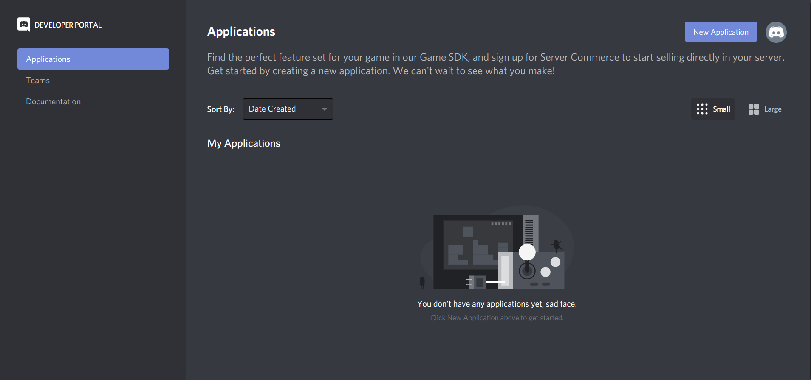
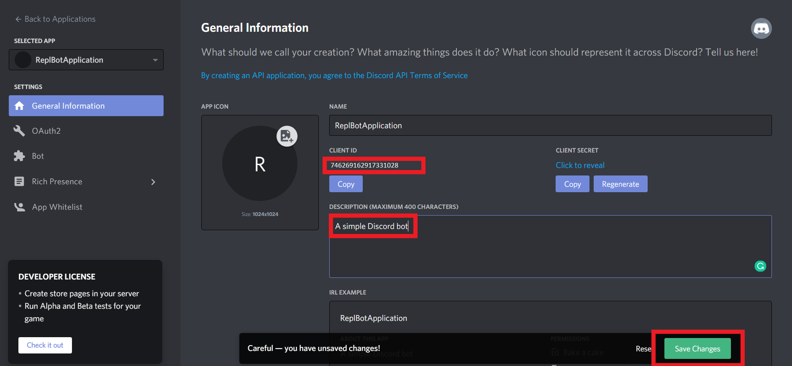
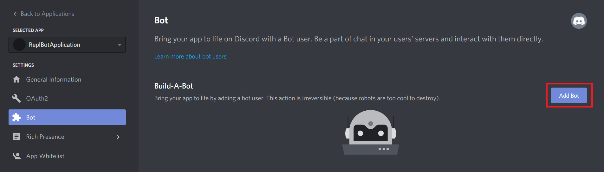
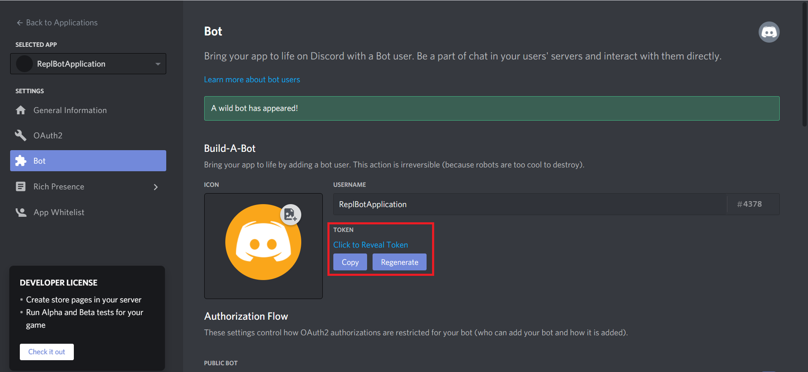
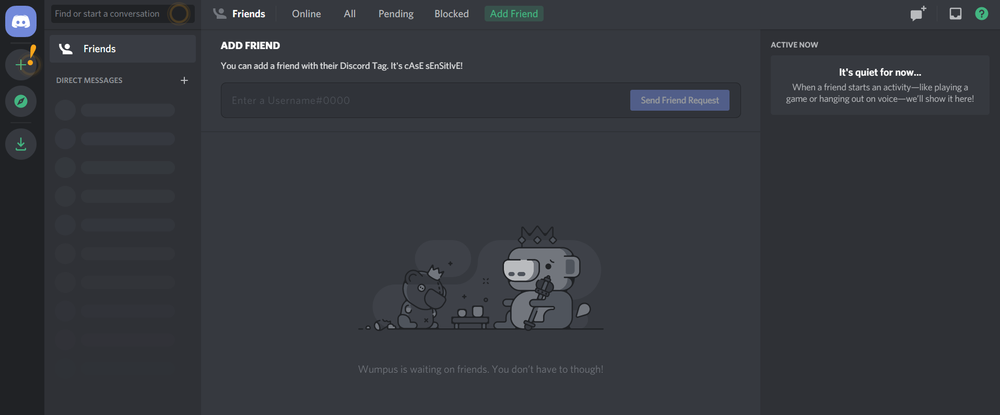
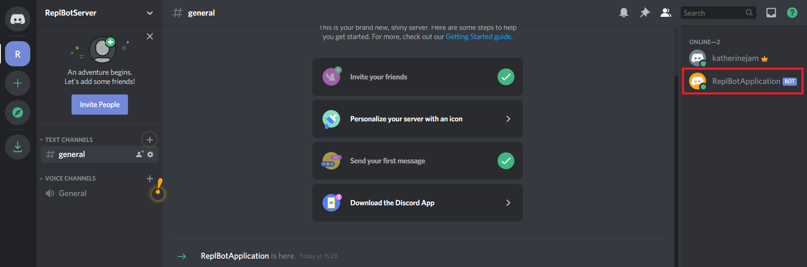
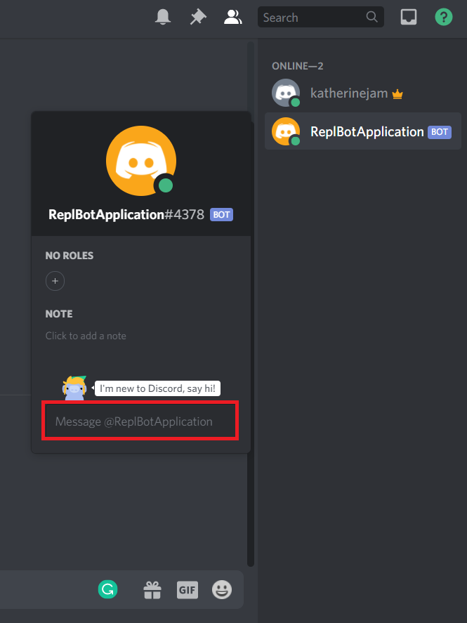

# Building a Discord bot with Node.js and Repl.it
In this tutorial, we'll use [Repl.it](https://repl.it) and Node.js to build a Discord Chatbot. If you're reading this tutorial, you probably have at least heard of Discord and likely have an existing account. If not, Discord is a VoIP and Chat application that is designed to replace Skype for gamers. The bot we create in this tutorial will be able to join a Discord server and respond to messages sent by people. 

If you don't like JavaScript, there's also a Python version of this tutorial in the previous chapter.

You'll find it easier to follow along if you have some JavaScript knowledge and have used Discord or a similar app such as Skype or Telegram before. We won't be covering the very basics of JavaScript, but we will explain each line of code in detail, so if you have any experience with programming, you should be able to follow along.

## Overview and requirements
We'll be doing all of our coding through the Repl.it web IDE and hosting our bot with Repl.it as well, so you won't need to install any additional software on your machine. For this tutorial you will need to create a [Discord](https://discordapp.com/) account (if you already have one, you can skip this). There are instructions for how to do this in the next section.

In this tutorial, we will be covering:
* Creating an application and a bot user in your Discord account
* Creating a server on Discord
* Adding our bot to our Discord server

Let's get through these admin steps first and then we can get to the fun part of coding our bot.

### Creating a bot in Discord and getting a token
 You can sign up for a free account over at [the Discord register page](https://discordapp.com/register), and can download one of their desktop or mobile applications from [the Discord homepage](https://discordapp.com/). You can also use Discord in the browser.

Once you have an account, you'll want to create a Discord application. Visit [the Discord developer's page](https://discordapp.com/developers/applications/) and press the "New application" button, as in the image below. 



Fill out a name for your bot and select "Create".

The first thing to do on the next page is to note your Client ID, which you'll need to add the bot to the server. You can come back later and get it from this page, or copy it somewhere where you can easily find it later.



You can also rename the application and provide a description for your bot at this point and press "Save Changes".

You have now created a Discord application. The next step is to add a bot to this application, so head over to the "Bot" tab using the menu on the left and press the "Add Bot" button, as indicated below. Click "Yes, do it" when Discord asks if you're sure about bringing a new bot to life.



The last thing we'll need from our bot is a Token. Anyone who has the bot's token can prove that they own the bot, so you'll need to be careful not to share this with anyone. You can get the token by pressing "Click to Reveal Token", or copy it to your clipboard without seeing it by pressing "Copy".



Take note of your token or copy it to your clipboard, as we'll need to add it to our code soon.


### Creating a Discord server
If you don't have a Discord server to add your bot to, you can create one by either opening the desktop Discord application that you downloaded earlier or returning to the Discord home page in your browser. Press the "+" icon indicated by the exclamation mark, as shown below, to create a server.



Press "Create a server" in the screen that follows, and then give your server a name. Once the server is up and running, you can chat with yourself, or invite some friends to chat with you. Soon we'll invite our bot to chat with us as well.

### Adding your Discord bot to your Discord server
Our Discord bot is still just a shell at this stage as we haven't written any code to allow him to do anything, but let's go ahead and add him to our Discord server anyway. To add a bot to your server, you'll need the Client ID from the "General Information" page that we looked at before when we created our ReplBotApplication (ie. the client ID, not the secret bot Token).

Create a URL that looks as follows, but using your Client ID instead of mine at the end:

https://discordapp.com/api/oauth2/authorize?scope=bot&client_id=746269162917331028

Visit the URL that you created in your web browser and you'll see a page similar to the following where you can choose which server to add your bot to.


Select the server we created in the step before this and hit the "authorize" button. After completing the captcha, you should get an in-app Discord notification telling you that your bot has joined your server.

Now we can get to the fun part of building a brain for our bot!

## Creating a Repl and installing our Discord dependencies
The first thing we need to do is create a Node.js Repl to write the code for our Discord bot. Over at [repl.it](https://repl.it), create a new Repl, choosing "Node.js" as your language.

We don't need to reinvent the wheel as there is already a great Node wrapper for the Discord bot API called [discord.js](https://discord.js.org/). Normally we would install this third-party library through [npm](https://www.npmjs.com/), but because we're using Repl.it, we can skip the installation. Our Repl will automatically pull in all dependencies. 

In the default `index.js` file that is included with your new Repl, add the following line of code.

```javascript
const Discord = require('discord.js');
```
Press the "Run" button and you should see Repl.it installing the Discord library in the output pane on the right, as in the image below.


Our bot is nearly ready to go -- but we still need to plug in our secret token. This will authorize our code to control our bot.


## Setting up authorization for our bot
By default, Repl code is public. This is great as it encourages collaboration and learning, but we need to be careful not to share our secret bot token (which gives anyone who has access to it full control of our bot). 

To get around the problem of needing to give our *code* access to the token while allowing others to access our code but *not* our token, we'll be using [environment variables](https://www.digitalocean.com/community/tutorials/how-to-read-and-set-environmental-and-shell-variables-on-a-linux-vps). On a normal machine, we'd set these directly on our operating system, but using Repl.it we don't have access to this. Repl.it allows us to set secrets in environment variables through a special `.env` file. 

First, we need to create a new file called exactly `.env`. Select "Add file" and name this file `.env`. It is important not to leave out the `.` at the beginning. Open this new file and add a variable to define your bot's secret token (note that this is the second token that we got while setting up the bot -- different from the Client ID that we used to add our bot to our server). It should look something like:

```bash
DISCORD_BOT_SECRET=NDcUN5T32zcTjMYOM0Y1MTUy.Dk7JBw.ihrTSAO1GKHZSonqvuhtwta16WU
```

You'll need to:
* **Replace** the token below (after the `=` sign) with the token that Discord gave you when creating your own bot.
* Be careful about **spacing**. If you put a space on either side of the `=` in your `.env` file, these spaces will be part of the variable name or the value, so make sure you don't have any spaces around the `=` or at the end of the line.
* Run the code again. Sometimes you'll need to refresh the whole page to make sure that your environment variables are successfully loaded.

In the image below you we've highlighted the "Add file" button, the new file (`.env`) and how to define the secret token for our bot's use.


Let's make a Discord bot that repeats everything we say but in reverse. We can do this in only a few lines of code. In your `index.js` file, add the following:


```javascript
const Discord = require('discord.js');
const client = new Discord.Client();
const token = process.env.DISCORD_BOT_SECRET;

client.on('ready', () => {
  console.log("I'm in");
  console.log(client.user.username);
});

client.on('message', msg => {
    if (msg.author.id != client.user.id) {
        msg.channel.send(msg.content.split('').reverse().join(''));
    }
});

client.login(token);
```

Let's tear this apart line by line to see what it does.

* **Line 1** is what we had earlier. This line both tells Repl.it to install the third party library and brings it into this file so that we can use it.
* In **line 2**, we create a Discord `Client`. We'll use this client to send commands to the Discord *server* to control our bot and send it commands. 
* In **line 3** we retrieve our secret token from the environment variables (which Repl.it sets from our `.env` file). 
* In **line 5**, we define an `event` for our client, which defines how our bot should react to the "ready" event. The Discord bot is going to run *asynchronously*, which might be a bit confusing if you're used to running standard synchronous code. We won't go into asynchronous coding in depth here, but if you're interested in what this is and why it's used, there's a good guide over at [RisingStack](https://blog.risingstack.com/node-hero-async-programming-in-node-js/). In short, instead of running the code in our file from top to bottom, we'll be running pieces of code in response to specific events.
* In **lines 6-8** we define how our bot should respond to the "ready" event, which is fired when our bot successfully joins a server. We instruct our bot to output some information server side (i.e. this will be displayed in our Repl's output, but not sent as a message through to Discord). We'll print a simple `I'm in` message to see that the bot is there and print our bot's username (if you're running multiple bots, this will make it easier to work out who's doing what). 
* **Lines 10-14** are similar, but instead of responding to an "ready" event, we tell our bot how to handle new messages. **Line 11** says we only want to respond to messages that aren't from us (otherwise our bot will keep responding to himself -- you can remove this line to see why that's a problem), and **line 12** says we'll send a new message to the same channel where we received a message (`msg.channel`) and the content we'll send will be the same message that we received, but backwards. To reverse a string, we split it into its individual characters, reverse the resulting array, and then join it all back into a string again.

The last line fires up our bot and uses the token we loaded earlier to log into Discord.

Press the big green "Run" button again and you should see your bot reporting a successful channel join in the Repl output.


Open Discord, and from within the server we created earlier, select your ReplBotApplication from the pane on the right-hand side of the screen.

.

Once you have selected this, you will be able to send a message (by typing into the box highlighted below) and see your bot respond!

.

The bot responds each time, reversing the text we enter.

.


## Keeping our bot alive
Your bot can now respond to messages, but only for as long as your Repl is running. If you close your browser tab or shut down your computer, your bot will stop and no longer respond to messages on Discord. 

Repl will keep your code running after you close the browser tab only if you are running a web server. Our bot doesn't require an explicit web server to run, but we can create a server and run it in the background just to keep our Repl alive. 

Create a new file in your project called `keep_alive.js` and add the following code:

```javascript
var http = require('http');

http.createServer(function (req, res) {
  res.write("I'm alive");
  res.end();
}).listen(8080);
```

We won't go over this in detail as it's not central to our bot, but here we start a web server that will return "I'm alive" if anyone visits it.

In our `index.js` file, we need to add a require statement for this server at the top. Add the following line near the top of `index.js`. 

```javascript
const keep_alive = require('./keep_alive.js')
```
After doing this and hitting the green "Run" button again, you should see some changes to your Repl. For one, you'll see a new pane in the top right which shows the web output from your server. We can see that visiting our Repl now returns a basic web page showing the "I'm alive" string that we told our web server to return by default.


Now your bot will stay alive even after closing your browser or shutting down your development machine. Repl will still clean up your server and kill your bot after about one hour of inactivity, so if you don't use your bot for a while, you'll have to log into Repl and start the bot up again. Alternatively, you can set up a third-party (free!) service like [Uptime Robot](https://uptimerobot.com/). Uptime Robot pings your site every 5 minutes to make sure it's still working -- usually to notify you of unexpected downtime, but in this case the constant pings have the side effect of keeping our Repl alive as it will never go more than an hour without receiving any activity. Note that you need to select the HTTP option instead of the Ping option when setting up Uptime Robot, as Repl.it requires regular HTTP requests to keep your chatbot alive.

## Forking and extending our basic bot
This is not a very useful bot as is, but the possibilities are only limited by your creativity now! You can have your bot receive input from a user, process the input, and respond in any way you choose. In fact, with the basic input and output that we've demonstrated, we have most of the components of any modern computer, all of which are based on the [Von Neumann architecture](https://en.wikipedia.org/wiki/Von_Neumann_architecture) (we could easily add the missing memory by having our bot write to a file, or with a bit more effort link in a [SQLite database](https://www.sqlite.org/index.html) for persistent storage).

If you followed along this tutorial, you'll have your own basic Repl bot to play around with and extend. If you were simply reading, you can easily fork my bot at [https://repl.it/@GarethDwyer1/discord-bot-node](https://repl.it/@GarethDwyer1/discord-bot-node) and extend it how you want (you'll need to add your own token and recreate the `.env` file still). Happy hacking!

If you're stuck for ideas, why not link up your Discord bot to the [Twitch API](https://dev.twitch.tv/) to get notified when your favourite streamers are online, or build a [text adventure](https://en.wikipedia.org/wiki/Interactive_fiction). 

In the next chapter, we'll be looking at building our own basic web application, using Django. This tutorial will also introduce you to HTML, JavaScript, and jQuery and will assist you in getting to the point where you can begin to build your own custom web applications.

